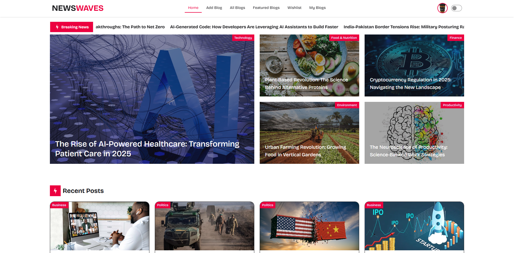

# NewsWaves

A modern, full-stack blogging web application built with the latest web technologies. NewsWaves delivers a seamless reading and publishing experience with a clean design, responsive layout, and powerful functionality tailored for both users and content creators.

---

## 🚀 Overview

NewsWaves is a professional blogging website featuring curated news, dynamic article management, user authentication, and highly interactive UI/UX components. Designed with scalability and performance in mind, it blends aesthetics with advanced technical implementations.

---

## 📂 Project Highlights

- Full authentication system with secure private routes and automatic logout on unauthorized access.
- Dynamic blog publishing: users can easily create new blogs and update existing ones in real time.
- Automatically organized recent posts section based on publishing timestamps.
- Complete blog management with fully dynamic CRUD operations connected to MongoDB.
- Advanced blog discovery: search, filter, sorting, related posts, and dynamic pagination.
- Wishlist system with persistent storage in the database.
- Interactive UI with skeleton loaders, dark/light mode, and fully responsive design.
- Featured content including marquee breaking news and a sortable Top Blogs table.
- Social sharing, comments, and curated homepage sections for enhanced engagement.

## 🖼️ Project Screenshots



<!-- ```


``` -->

## 🌟 Core Features

### **🔐 Authentication & User Management**

- Secure login and registration system.
- Firebase Authentication with Google sign‑in support.
- Automatic logout on unauthorized access using Axios response interceptors.
- Authorization token injected automatically into all Axios/fetch requests.

### **📝 Blog Management**

- Create, update, and delete personal blog posts.
- Rich blog creation form supporting title, slug, category, image, short and long description, tags, and breaking‑news status.
- All blog operations fully dynamic and connected to MongoDB.

### **📚 Browsing & Discovery**

- **Featured Blogs** displayed prominently across the platform.
- **Recent Blogs** and curated categories such as International Political Affairs & Business Insights.
- **Related News** section based on category matching.
- Global **search**, **filter**, and **sorting** for all blogs.
- Dynamic **pagination control**, allowing users to choose items per page.

### **⭐ Wishlist System**

- Add any blog to wishlist.
- All wishlist items are saved in the database.
- Access and read wishlisted posts later.
- Remove wishlist items anytime.

### **📊 Featured Table (Top Blogs)**

- Powered by **TanStack Table**.
- Sortable table showing top 10 blogs by length.
- Smooth and responsive data interactions.

### **💬 Comments & Engagement**

- Users can comment on any blog.
- Social sharing buttons for sharing blog posts across multiple platforms.

### **📰 Breaking News Marquee**

- A dynamic marquee displaying breaking news selected by blog creators.

### **🎨 UI/UX & Design**

- Beautiful hero section featuring curated blog selections.
- Clean and modern layout with enhanced readability.
- Fully responsive across all devices.
- Dark/Light theme toggle.
- Newsletter section on the homepage.
- Amazing skeleton loading animations (implemented with react-loading-skeleton) on blog lists and single blog pages to provide polished loading states and improve perceived performance.

### **🔒 API Security**

- Private routes protected on the backend.
- Unauthorized attempts trigger automatic logout.
- Secure API communication with token validation.
- Private routes protected on the backend.
- Unauthorized attempts trigger automatic logout.
- Secure API communication with token validation.

### **⚡ Performance & Code Quality**

- Clean code architecture.
- Reusable React components.
- Optimized API calls using TanStack Query.
- Error handling and data caching for smooth user experience.

---

## 🛠️ Tech Stack

### **Frontend**

- React
- Tailwind CSS
- DaisyUI
- Axios
- TanStack Query
- TanStack Table
- Firebase (Authentication)

### **Backend**

- Node.js
- Express.js
- MongoDB (Native driver)

---

## 📱 Responsive Design

NewsWaves provides a consistent and polished experience across mobile, tablet, and desktop.

---

## ✨ Author

Developed by **Abdul Hamid**, Full‑Stack Web Developer passionate about modern web applications, clean architecture, and user‑focused design.

---

## 🎯 Purpose

This project is an example of full‑stack proficiency, demonstrating expertise in frontend engineering, backend development, API security, and modern tooling—ideal for showcasing technical ability to recruiters, collaborators, and the developer community.

---
